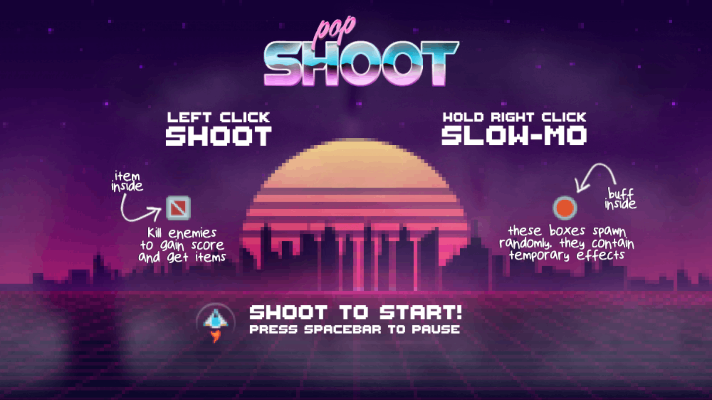
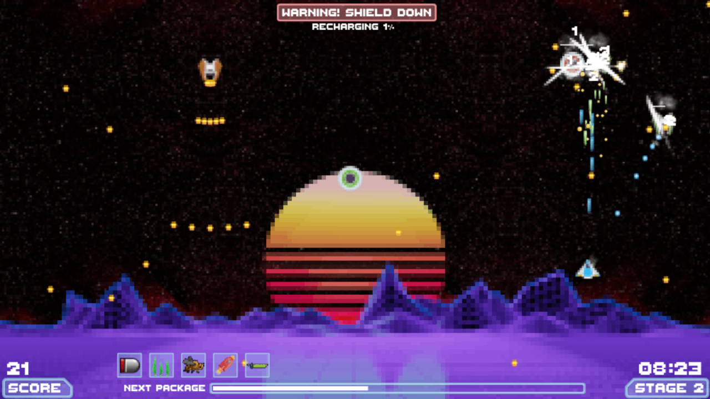
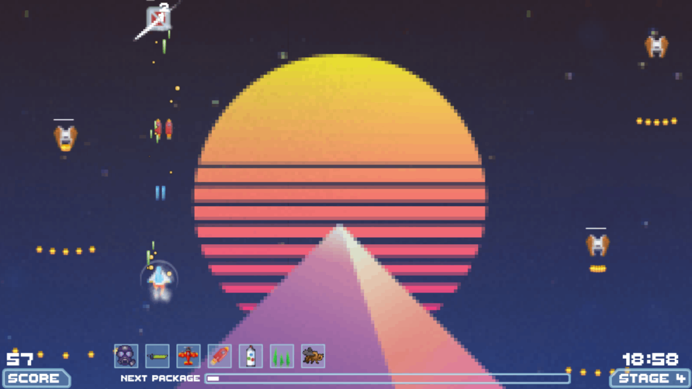
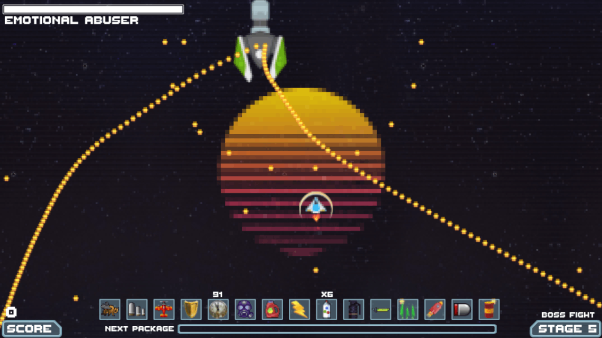

# pop-shoot

A synthwave styled space shooter, inspired by the 80s arcades. Written in plain Javascript.  
The game includes 5 stages & bosses, as well as many cool features such as bullet-time, randomized item drops, weather effects and an awesome soundtrack by TeknoAxe.

:joystick: [Play](https://kiwphi.github.io/pop-shoot/) (F11 to toggle full-screen)  
:beetle: [Report Bug](https://github.com/kiwphi/pop-shoot/issues)

# screenshots

# debugging

The `Logic/State/Debugging.js` file provides some useful keybindings for jumping around the game without having to modify the code:

-   Jump to stage keys: `1` `2` `3` `4` `5`
-   Jump to current-stage boss (10 seconds before boss spawn): `B`
-   Receive random item: `I`
-   Clear items: `C`
-   Kill all enemies on-screen: `K`
-   Spawn RedPackage: `R` OrangePackage: `O`
-   Toggle weather: `W`
-   Keep playing after gameover: `P`

# license

This repository consists of two major parts:

-   The _source-code_, mostly contained within the ./modules directory
    is under the [GNU GPL-3.0 License](https://github.com/kiwphi/pop-shoot/blob/main/LICENSE).
-   The _assets_, which are all contained within the ./assets directory were fetched from several sources
    (mentionned in the _acknowledgments_ section) and are not under the same license. Each asset is owned by its respective author.

# acknowledgments

:musical_note: Music by [TeknoAxe](https://open.spotify.com/artist/0Hyqsw7GWssXIOVgy36ohS)  
:art: Original background images by [Paul Craft](https://co.pinterest.com/paulcraftone/) & [Nate Wren](https://natewren.com)  
:flying_saucer: Sprites & Audio by [Kenney.nl](https://kenney.nl), [OpenGameArt](https://opengameart.org) & [kalebsilva](https://www.vecteezy.com/members/kalebsilva)  
:pencil2: Fonts by [Rick Hoppman](https://www.dafont.com/thaleahfat.font), [Asiyah](https://www.dafont.com/handwriting-5.font) & [Photofunia](https://photofunia.com)

# tracklist

[Ascent to the Station](https://www.youtube.com/watch?v=r5L-CY9TcRc)  
[Retro Future Nights](https://www.youtube.com/watch?v=D_jQLR6zq30)  
[Lost in the Ether](https://www.youtube.com/watch?v=q2DFmJ46jFw)  
[Electronic Sunrise](https://www.youtube.com/watch?v=yjCWwkuOX7U)  
[City Lanes](https://www.youtube.com/watch?v=caPQEDHfaOI)  
[Nineteen Eighty Seven](https://www.youtube.com/watch?v=j6XKMywP3-g)  
[Dark Versus Light](https://www.youtube.com/watch?v=uxD88mxMDQc)  
[Twilight Metropolis A](https://www.youtube.com/watch?v=k1C1algxG0E)  
[Dystopian Paradise](https://www.youtube.com/watch?v=j9l6QWj4JqU)  
[Synthwave E](https://www.youtube.com/watch?v=RBxnYXGNNAk)
